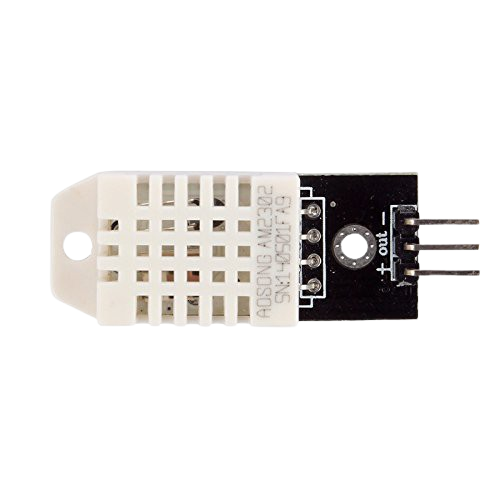
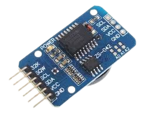
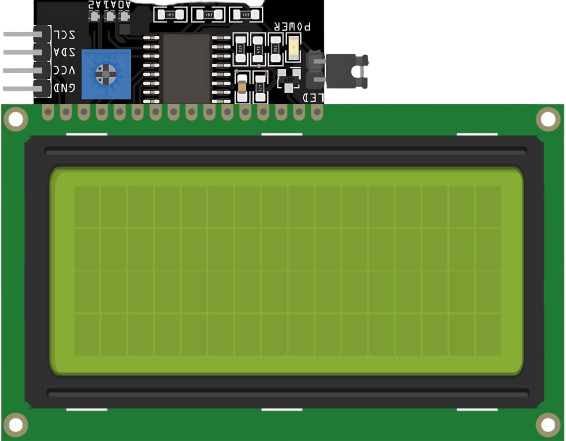
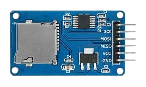
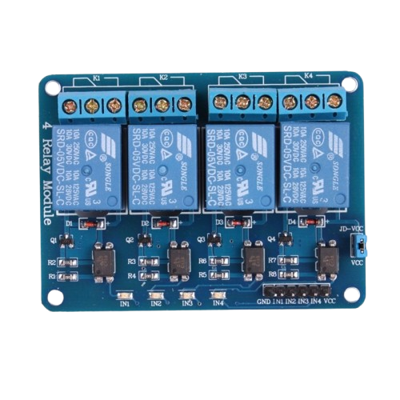
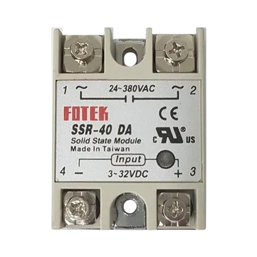
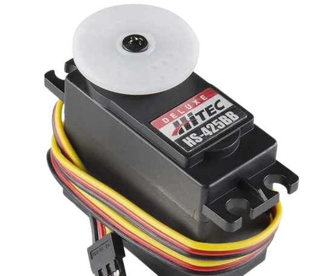
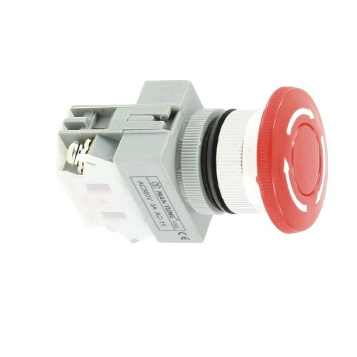
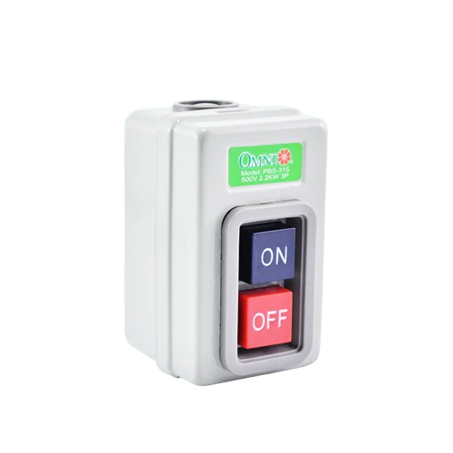
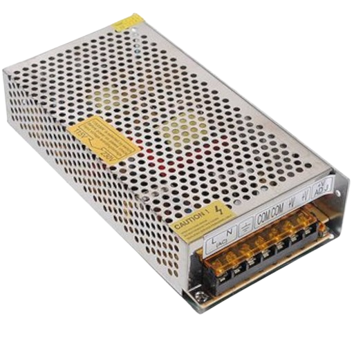

# IABE-MICROCLIMATE CONTROLLED CHAMBER FOR MULBERRY LEAF STORAGE


---

## 📌 Features
- 🌡️ Redundant sensor temperature & humidity monitoring
- 🌀 Automated exhaust & drum control
- 💧 Misting system
- 🧠 RTC-based timestamping
- 💾 SD card data logging
- 📟 I2C LCD status display
- 🔘 One Button menu system
- ⚡ Non-blocking control logic

--------------------------------------------

## 🧰 Hardware Used
- Arduino Mega 2560


- DHT22 (x2)


- DS3231 RTC (CR22 Battery)


- I2C LCD (20x4)


- SD Card Module (SPI)


- Relays (Pump, Motor, Fans)


- SSR relay


- Servo Motor


- Push Button


- Emergency Off switch


- Main Power Switch



- Switch Mode Power Supply



---
## 📖 How To Use

### On First Setup
- Install the power supply. Connect main power(labelled "TOPOWERSUPPLY220V") to the power supply's L and N pins. Connect 12v(labelled "FromPOWERSUPPLY12V") to power supply,white wire to V+, grey to V-. (see pinout below)
- Format and Insert a clean 32GB sdcard to the sdCard module.
- Ensure to connect the right outputs to the its corresponding pins as labeled on the terminal blocks inside the control panel(see pinout below), Or namely:

```txt
TERMINAL BLOCK 1
├── 1 MIST PUMP +
├── 2 MISTPUMP -
├── 3 RECIRCULATING FAN +
├── 4 RECIRCULATING FAN -
├── 5 DRUM MOTOR +
├── 6 DRUM MOTOR -
├── 7 SERVO MOTOR +
├── 8 SERVO MOTOR -
└── 9 SERVO PWM
TERMINAL BLOCK 2
├── 5 REF -
├── 6 REF +
├── 7 REF_FAN -
├── 8 REF_FAN +
|
├── 11 AC PLUG
└── 12 AC PLUG
```

### Startup
1. Power ON control panel
2. LCD shows welcome screen
3. Last treatment and states restored
4. System enters automatic mode

### Selecting Treatment
1. Long-press button → enter menu
2. Short-press → cycle T1–T3
3. Long-press → confirm

### Normal Operation
- Fully automatic
- No user action required
- All timing based on RTC

### Power Loss Recovery
- States restored from EEPROM
- No recalibration required
---
## Pinout
| SENSOR |COMPONENT PIN| Arduino Pin | Notes |
|--------|------------|------|------|
|DHT 22 |  VCC | 5V |power |
| |  GND   | GND | common ground |
| | #1 out| D48 |signal|
| | #2 out| D49 | signal |
| |--------|------------|------|
|  Push Button| NO| D3 | Normally close |
| | COM | 5v | Pulldown |
| |--------|------------|------|
|LCD | VCC | 5V | Address `0x27`, 20x4 |
| | GND | GND | Address `0x27`, 20x4 |
| | LCD SDA | SDA | I2C |
| | LCD SCL | SCL | I2C |
||--------|------------|------|
|Relay|VCC|5V|Power|
||GND|GND|Common ground|
|| Misting Pump Relay | D4 | Active LOW |
|| Circulating Fans Relay | D5 | Active LOW |
|| Drum Motor Relay | D6 | Active LOW |
|| Servo Power Relay | D7 | Active LOW |
|| Ref SSR  | D8 | Active HIGH, pulldown |
||--------|------------|------|
|Exhaust Servo | PWM | D9 | Powered via relay |
||--------|------------|------|
|SD Card|  VCC | 5V | Power |
||  GND | GND | Common ground |
||  MOSI | D51 | SPI |
||  MISO | D50 | SPI |
||  CS | D53 | SPI |
||  SCK | D54 | SPI |
||--------|------------|------|
|RTC DS3231|  VCC | 5V | Power |
||  GND | GND | Common ground |
|| SDA | SSDA | I2C |
|| SCL | SCL | I2C |
||--------|------------|------|
|Buck Converter|  Out + | 5V | Power |
||  Out - | GND | Common ground |
|--------|------------|------||

### 220V-12v POWER RAIL
| COMPONENT | COMPONENT PIN |Connection To|Notes|
|----------|----------|-------|-------|
|MAIN POWER SWITCH|AC_OUT1|SMPS N|orange wire|
|                 |AC_OUT2|SMPS L|orange wire|
|                 |AC_IN1|EMERGENCY SWITCH|white wire|
|                 |AC_IN2|AC PLUG|grey wire|
|EMERGENCY SWITCH|COM|AC PLUG|white wire|
||NO|MAIN POWER SWITCH AC_IN1|normally open|
| SMPS  | L  |POWERSUPPLY220V|white wire|
|   | N  |TOPOWERSUPPLY220V|grey wire|
|   | V+ |FROMPOWERSUPPLY12V| white wire|
|   | V-  |FROMPOWERSUPPLY12V|grey wire|
| Buck Converter| In + | SMPS V+|12v|
|   | In-  |SMPS V-|12V|
|   | Out +  |Arduino 5V||
|   | Out -  |Arduino 5V||
---


## Basic Troubleshooting

### LCD Shows ERR
- One or both DHT sensors failed
- Unplug then plugin. ensure not to switch polarities.(red +, blue -)
- Check wiring, power, and signal connectivity to D49, D50

### Misting Pump Not Turning On
- Humidity above minimum
- Relay wiring incorrect polarity
- Pump power supply missing

### Drum Motor Not Running
- Interval not reached yet
- Relay wiring
- EEPROM time corruption (reflash)
- Drum is stuck or overloaded.

### SD Write Error
- Format SD card (FAT32). It is imperative to backup data first.
- Card seated properly

### Servo Not Moving
- Servo relay not energized
- PWM pin incorrect
- External power missing

---
## VERY IMPORTANT REMINDER

- Before removing the sd card for data extraction, TURN OFF THE PROTOTYPE FIRST!

- Before removing, Testing any module or any component, MAKE SURE TO CUT OFF POWER FIRST!


